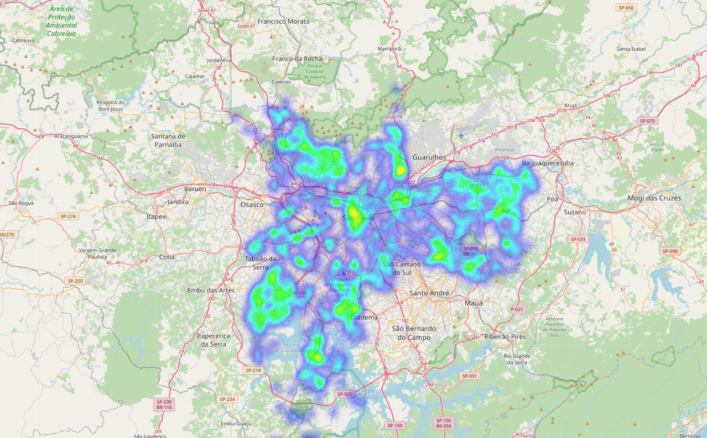

## Data Science Portfolio

---

[A Study on Algorithms for Learning Probabilistic Circuit Structures](/probabilistic_circuits.md)

---
[Prediction of Heart Attacks Using Machine Learning](/heart_analysis.md)

---
[Crime in São Paulo: an Exploratory and Geospatial Analysis](http://example.com/)

---

Page template forked from <a href="https://github.com/evanca/quick-portfolio">evanca</a>

